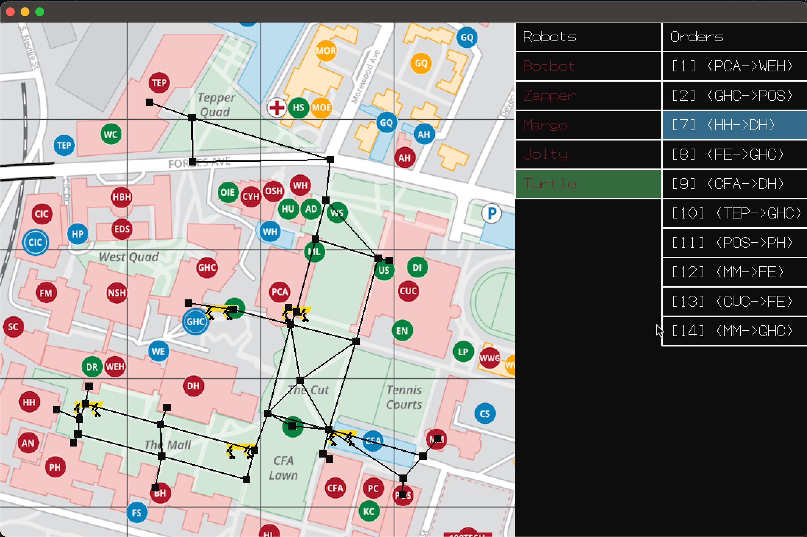

Final Project for 24-780 Engineering Computation at Carnegie Mellon Universtiy.

This code is hosted on GitHub at: https://github.com/kcmw3e/deliverulator

Group Members:
    - Mya Chappell
    - Atharva Manohar Mhaskar
    - Casey Walker
    - Eric Zhao
    - Rubin Chen

The project is a simulated delivery system/game in which a player selects from a set of available
delivery robots and assigns them to randomly-generated orders. Each robot follows a planned path in
order to accomplish its delivery around locations on CMU's campus.


Play instructions
----------------------------------------------------------------------------------------------------
    The objective of the game is to assign orders to robots. The robots will complete an assigned
    order by traveling to the order's source (which is one of the buildings on campus) to pick up
    the package. The robot will then proceed to the destination of the order and drop the package
    off. The player's task is to complete orders in the most efficient manner possible by assigning
    them to robots that are closest to the order. New orders will be randomly generated whenever a
    robot is assigned an order.

    Controls
        - <ENTER> assign the selected order to the selected robot
        - <TAB>   switch between selecting the robot and selecting the order
        - <UP>    move the selection up in the active column
        - <DOWN>  move the selection down in the active column
        - <ESC>   close the program

    The green cell indicates the currently selected object in the currently active column. The blue
    cell indicates the currently selected object in the inactive column. These colored cells then
    indicate the pairing of a robot to an order when <ENTER> is pressed. Upon order assignment, a
    robot's name will turn red and the robot can no longer be assigned an order until the robot has
    completed its active order, at which time the name will return to its original color.


Compilation
----------------------------------------------------------------------------------------------------
    To compile, simply add the main source file `deliverulator.cpp`, the source files located in the
    `src/` directory, and the header files located in the `include` directory to your respective
    build system (e.g. Visual Studio, XCode), or to your compilation command such as

        `clang++ -o build/deliverulator deliverulator.cpp ./src/* -I./include/`

    Also make sure you can link to the class library files (i.e. `fssimplewindow`, `yspng`, etc.)
    and include the respective headers in your build system. This could also be done by copying the
    class library source files to the `src/` directory and the header files to the `include/`
    directory before adding them to you build system.

    After compiling, make sure to copy the *whole* `resrc/` directory to the same location as your
    compiled executable. For example, if your executable is placed in a directory called `build/`,
    you should also have a directory `build/resrc/` that contains the same files as `resrc/` in the
    root directory of this project. When this is done, simply run the program however you like on
    your machine (e.g. `./build/deliverulator` on the command line).

```
For Mac Users
1. g++ fssimplewindowobjc.m -c
2. mkdir -p test.app/Contents/MacOS
3. g++ -std=c++17 -I ./include/ deliverulator.cpp ./src/*  -framework Cocoa -framework OpenGL -o test.app/Contents/MacOS/test
4. ./test.app/Contents/MacOS/test 
```


